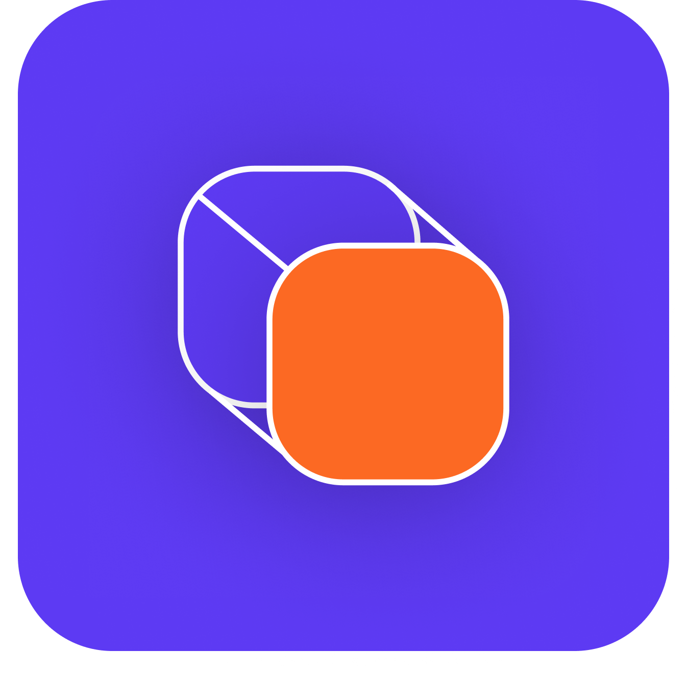

<!-- PROJECT LOGO -->
<br />


<h6 align="center">Interactive Development 300</h6>
<h6 align="center">Pieter Venter 200054</h6>
<h6 align="center">Dylan Vanhout 190160</h6>
<p align="center">
</br>
   
  <a href="https://github.com/Pieter-stack/EduCube2">
    
  </a>
  
  <h3 align="center">EduCube2</h3>

  <p align="center">
    This desktop application is for universities that want an efficient way to administrate students, subjects and staff. The university management application allows university employees to manage the university administration system, by allowing the user to view the details of people and subjects, as well as register lecturers and studets for subjects. The management system also allows the user to view the total amount for salaries and tuition fees due each month.
<br>
      <a href="https://github.com/Pieter-stack/EduCube2"><strong>Explore the docs »</strong></a>
      <br />
      <br />
      <a href="add video">View Demo</a>
       ·
       <a href="https://github.com/Pieter-stack/EduCube2/issues">Report Bug</a>
       ·
       <a href="https://github.com/Pieter-stack/EduCube2/issues">Request Feature</a>
   </p>

<!-- TABLE OF CONTENTS -->
## Table of Contents

* [About the Project](#about-the-project)
  * [Project Description](#project-description)
  * [Built with](#built-with)
* [Getting Started](#getting-started)
  * [Prerequisites](#prerequisites)
  * [Installation](#installation)
* [Features and Functionality](#features-and-functionality)
   * [Features](#features)
   * [Functionality](#functionality)
* [Concept Process](#concept-process)
   * [Ideation](#ideation)
   * [Wireframes](#wireframes)
   * [User-flow](#user-flow)
* [Development Process](#development-process)
   * [Implementation Process](#implementation-process)
        * [Highlights](#highlights)
        * [Challenges](#challenges)
   * [Reviews and Testing](#reviews-and-testing)
   * [Future Implementation](#future-implementation)
* [Final Outcome](#final-outcome)
   * [Mockups](#mockups)
   * [Promotional Video](#promotional-video)
* [Roadmap](#roadmap)
* [Contributing](#contributing)
* [License](#license)
* [Contact](#contact)
* [Acknowledgements](#acknowledgements)

<!--PROJECT DESCRIPTION-->
## About the Project

![image1][image1]

### Project Description
This app is designed and developed for university administrators to experience an effecient way of managaging their students, subjects staff and finances.

This app features a data driven dashboard page which provides an overview of various analytics. This includes the total diploma & degree students, total academic & admin staff, total subjects and the funds pools figures.

This app features Student and Staff management pages which allow the Admin staff to view a person's details and subjects. The app also allows the registering of new students and staff. The Student and Staff management pages makes use of CRUD operations to Create, Read, Update and Delete records in the database. 

This app features a Subject management page which allow the Admin staff to view a subject's details. The app also allows the registering of new subject and makes use of CRUD operations to Create, Read, Update and Delete records in the database.

This app features an build in seach functionality on the Student, Staff and Subject management pages. Which allows the Admin staff to search people by name or ID number.

This app features a Funds Pool page which allows the Admin staff to recieve tuition fees and make salary payments which is done at the closing of the calendar month.

### Built With

* [Visual Studio](https://visualstudio.microsoft.com/)
* [.NET](https://docs.microsoft.com/en-us/dotnet/)
* [MAUI](https://docs.microsoft.com/en-us/dotnet/maui/)
* [GitHub](https://github.com/)


&nbsp;&nbsp;&nbsp;&nbsp;&nbsp;&nbsp;&nbsp;&nbsp;
&nbsp;&nbsp;&nbsp;&nbsp;&nbsp;&nbsp;&nbsp;&nbsp;
&nbsp;&nbsp;&nbsp;&nbsp;&nbsp;&nbsp;&nbsp;&nbsp;
&nbsp;&nbsp;&nbsp;&nbsp;&nbsp;&nbsp;&nbsp;&nbsp;

<!-- GETTING STARTED -->
## Getting Started

These instructions will get you a copy of the project up and running on your local machine for development and testing purposes.

### Prerequisites

For development, the latest version of `Visual Studio` is required. The latest version can be downloaded from [Visual Studio](https://visualstudio.microsoft.com/)
During the installation of Visual Studio make sure to select the following: `ASP.Net and web development`, `.NET Multi-platform App UI development` and `.NET desktop development`.

### Installation
Here are a couple of ways to clone this repo:

1. Visual Studio </br>

`Visual Studio` -> `File` -> `Clone Repository` -> `Git`
Enter the Git repository URL into the URL field and press the `Clone` button.
  ```sh 
  https://github.com/Pieter-Stack/EduCube2.git
  ``` 
2. Git Clone Repository

Run the following in the git command-line in the terminal:
  ```sh
   git clone https://github.com/Pieter-Stack/EduCube2.git
  ```
Open `Visual Studio` and select `File | Open` from the menu. Select `Open Project/Solution` and select the cloned directory and press `Open` button.

3. Install Dependencies </br>
When you build the project for the first time. `Nuget Package Manager` will install any project dependencies and packages required.

4. Implement Database </br>
The database is an SQLite database which is created and stored locally. When starting the project for the first time there will be zero data to work with. You are required to add your own data for example: admin, staff, students and subjects.

5. Build and Run

<!-- FEATURES AND FUNCTIONALITY-->
## Features and Functionality

### Features

### Login Screen.

![image10][image10]

Admin Authentication and Validation allowing only Admin users to access the app.

### Dashboard Screen. 

![image2][image2]

Dashboard overview of student, staff and subject totals with dynamic charts.

### Student Management Screen.

![image4][image4]

View, Create, Update and Delete student accounts and assing subjects to each student, as well as search a student by name or ID number.

### Staff Management Screen.

![image3][image3]

View, Create, Update and Delete staff accounts as well as search by name or ID number.

### Subject Management Screen.

![image6][image6]

Admin user can view, create, update and delete subjects.

### Funds Management Screen.

![image5][image5]

Admin user can manage the fund pool by processing tuition fees and staff salaries at the end of each month.


### Artwork and designs created by Pieter and Dylan.

Figma was used to collaborate and design the user interfaces.

### Functionality

* `Login Screen` administration staff are able to log on to the system with their email & password and log off of the system.
* `Login Screen` includes authentication validation.
* `Dashboard Screen` is the first screen the user will see when logging on to the system.
* `Dashboard Screen` has a summary of the data on the system including the following: Total Diploma Students & Degree Students, Total Academic Staff & Admin Staff, Total Subjects, and the Funds Pool.
* `Student Management Screen` the user is able to see all the students, edit the information of a student and add a new student.
* `Subject Management Screen` the user is able to see all the subjects, edit the information of a subject, add a new subject and assign students and lecturer to a subject.
* `Staff Management Screen` the user is able to view all the academic and administration staff, edit the information of all staff members and add new staff members.
* `Funds Screen` the user is able to view the total salaries for each month, view the total income student tuition fees.
* `Funds Screen` the user is able to close off a month: collect the student fees and pay staff members and then start a new month.
* `Search` functionality implement on the Student, Staff and Subject pages.

<!-- CONCEPT PROCESS -->
## Concept Process

The `Conceptual Process` is the set of actions, activities and research that was done when starting this project.

### Ideation

![image7][image7]

### Wireframes

![image8][image8]

### User-flow Diagram

![image9][image9]

<!-- DEVELOPMENT PROCESS -->
## Development Process

The `Development Process` is the technical implementations and functionality done in the backend of the application.

### Implementation Process

#### Design Architecture
* `.NET MAUI` is a cross-platform framework for creating native mobile and desktop apps with `C#` and `XAML`.
* `MVVM` (Model-View-ViewModel) software desing pattern used to seperate the program logic and user interface controls.
#### Highlights

* 
* 
* 
* 

#### Challenges

* Was a challenge because of the scale of the project but I got all of the functionality in and also added a couple of golf courses for v1.0 to test.

### Reviews and Testing
The `Reviews and Testing` consists of `in class`, reviews.

#### Future Implementation

* 
* 
* 

<!-- MOCKUPS -->
## Final Outcome

### Mockups

![image11][image11]

<!-- PROMO VIDEO -->
## Promotional Video

To see the promotional video, click below:

[View Promotional Video](https://www.youtube.com/)

<!-- ROADMAP -->
## Roadmap

See the [open issues](https://github.com/Pieter-stack/EduCube2/issues) for a list of proposed features (and known issues).

<!-- CONTRIBUTING -->
## Contributing

Contributions are what make the open source community such an amazing place to be learn, inspire, and create. Any contributions you make are **greatly appreciated**.

1. Fork the Project
2. Create your Feature Branch (`git checkout -b feature/AmazingFeature`)
3. Commit your Changes (`git commit -m 'Add some AmazingFeature'`)
4. Push to the Branch (`git push origin feature/AmazingFeature`)
5. Open a Pull Request

<!-- AUTHORS -->
## Authors

* **Pieter Venter** - [PieterVenter](https://github.com/Pieter-stack)
* **Dylan Vanhout** - [DylanVanhout](https://github.com/hellodvh)

<!-- LICENSE -->
## License

Distributed under the MIT License. See `LICENSE` for more information.\

<!-- LICENSE -->
## Contact

* **Pieter Venter**  - pieterven12@gmail.com
* **Dylan Vanhout**  - 190160@virtualwindow.co.za
* **Project Link** - https://github.com/Pieter-stack/EduCube2

<!-- ACKNOWLEDGEMENTS -->
## Acknowledgements

* [Microsoft](https://www.microsoft.com/)
* [Mockups](https://www.freepik.com/free-psd/desktop-screen-with-website-presentation-mockup-isolated_23126508.htm#query=slides%20mockup%20screen%20mockup&position=13&from_view=search)
* [Lecturer](https://github.com/ArmandPret)


<!-- MARKDOWN LINKS & IMAGES -->
[image1]: Images/Image1.png
[image2]: Images/Image2.png
[image3]: Images/Image3.png
[image4]: Images/Image4.png
[image5]: Images/Image5.png
[image6]: Images/Image6.png
[image7]: Images/Image7.png
[image8]: Images/Image8.png
[image9]: Images/Image9.png
[image10]: Images/Image10.png
[image11]: Images/Image11.png

 
